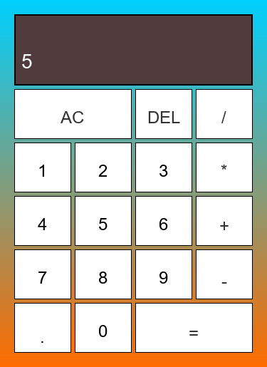
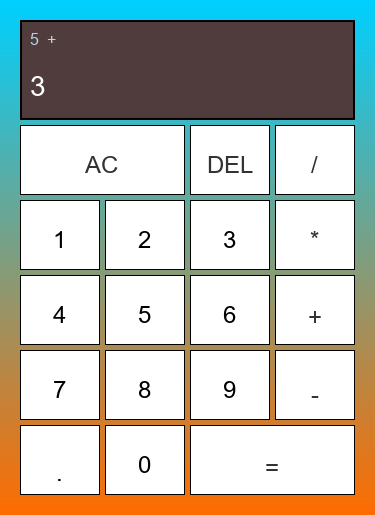

<p># 🧮 Hesap Makinesi (Calculator)

Basit fakat işlevsel bir hesap makinesi uygulaması. HTML, CSS ve JavaScript kullanılarak geliştirilmiş, modern ve kullanıcı dostu bir arayüze sahiptir.

## 📋 Özellikler

- ✅ **Temel Matematiksel İşlemler**: Toplama (+), Çıkarma (-), Çarpma (*), Bölme (/)
- ✅ **Ondalık Sayı Desteği**: Ondalık noktalar ile hassas hesaplamalar yapabilirsiniz
- ✅ **AC Butonu**: Tüm verileri temizleyip baştan başlayabilirsiniz
- ✅ **DEL Butonu**: Son girdiğiniz rakamı silip düzeltme yapabilirsiniz
- ✅ **Responsive Tasarım**: Güzel gradient arka plan ve modern kullanıcı arayüzü
- ✅ **Kolay Kullanım**: Sezgisel buton düzeni ve açık ekran gösterimi

## 🎨 Arayüz Açıklaması ve Ekran Resimleri

### Ekran Bölümü
- **Üst Kısım**: Önceki işlemi gösteren alan (ör: "5 +")
- **Alt Kısım**: Şu anki girilen sayıyı gösteren ana ekran

### Ana Arayüz

*Hesap Makinesi - Ana Ekran*

### Kullanım Adımları

#### 1️⃣ Sayı Girişi

*"5" numarası girilmiş duruma benzer*

#### 2️⃣ İşlem Seçimi  

*Toplama işlemi (+) seçilmiştir*

#### 3️⃣ İkinci Sayı Girişi

*İkinci sayı (3) girilmiş duruma benzer*

#### 4️⃣ Sonuç

*"=" basıldıktan sonra sonuç (8) görüntülenir*

### Buton Düzeni (4x6 Grid)
```
┌─────────────────────────────┐
│    Önceki  │  Şimdiki      │
├─────────────────────────────┤
│    AC (2 sütun)  │ DEL │ /  │
│     1     │  2    │  3  │ *  │
│     4     │  5    │  6  │ +  │
│     7     │  8    │  9  │ -  │
│     .     │  0    │ = (2 sütun) │
└─────────────────────────────┘
```

## 🚀 Kullanım

1. **Bir sayı girin**: Numara butonlarını (0-9) tıklayarak sayı girin
2. **İşlem seçin**: (+, -, *, /) butonlarından birini tıklayın
3. **İkinci sayıyı girin**: Başka bir sayı girin
4. **Sonucu alın**: "=" butonunu tıklayarak sonucu görebilirsiniz

### Örnekler
- `5 + 3 =` → `8`
- `10 * 2 =` → `20`
- `15 / 3 =` → `5`
- `7.5 + 2.5 =` → `10`

## 💡 Özellik Yapısı

### HTML (site.html)
- Semantik HTML5 yapısı
- Grid tabanlı buton düzeni
- Erişebilirlik için data attributes kullanımı

### CSS (style.css)
- **Renk Şeması**: Mavi (#00d0ff) ile turuncu (#ff5e00) gradient arka planı
- **Layout**: CSS Grid ile responsive tasarım
- **Hover Efekti**: Butonlara hover yapıldığında mavi arka plan
- **Matematik Kutusu**: Koyu renkli çıktı alanı

### JavaScript (script.js)
- **Calculator Sınıfı**: Tüm matematiksel işlemleri yönetir
- **Yöntemler**:
  - `clear()`: Hesapları temizle
  - `appendNumber()`: Sayı ekle
  - `addOperation()`: İşlem seç
  - `compute()`: Hesapla
  - `updateDisplay()`: Ekranı güncelle
  - `delete()`: Son karakteri sil

## 🛠️ Teknolojiler

- **HTML5**: Yapı ve semantik
- **CSS3**: Tasarım ve animasyonlar
- **JavaScript (ES6)**: İşlevsellik ve mantık
- **OOP**: Class yapısı kullanımı

## 📁 Dosya Yapısı

```
calculator/
├── README.md          # Bu dosya
├── site.html          # Hesap makinesi arayüzü
├── style.css          # Stillendirme
└── script.js          # Web işlevleri
```

## 🎯 Kullanım Talimatları

1. `site.html` dosyasını bir tarayıcıda açın
2. Hesap Makinesi arayüzü ekranda görünecektir
3. İstediğiniz işlemleri gerçekleştirin
4. AC butonuyla istediğiniz zaman sıfırlayabilirsiniz

## ⚙️ Kurulum ve Çalıştırma

Herhangi bir kurulum gerektirmez! Sadece:

1. Dosyaları indirin veya klonlayın
2. `site.html` dosyasını tarayıcıda açın
3. Kullanmaya başlayın!

```bash
# Eğer yerel sunucu kullanmak isterseniz:
# Python 3
python -m http.server 8000

# Node.js
npx http-server
```

Sonra tarayıcınızda `http://localhost:8000` adresine gidin.

## 🎓 Öğrenme Kaynakları

Bu proje aşağıdaki konuları öğrenmeye yardımcı olur:
- HTML Grid Layout
- CSS Gradient ve Flexbox
- JavaScript OOP (Sınıflar)
- Event Listeners ve DOM Manipülasyonu
- Switch Case İfadeleri

## 📝 Geliştirme Fikirleri

Proje geliştirmek istiyorsanız bu özellikleri ekleyebilirsiniz:
- 🔢 Geçmiş kayıt (History)
- 🌙 Koyu tema (Dark Mode)
- 📊 İleri matematiksel işlemler (sin, cos, kare kök vb.)
- ⌨️ Klavye desteği
- 💾 İşlemleri kaydetme
- 🎨 Daha fazla tema seçeneği
